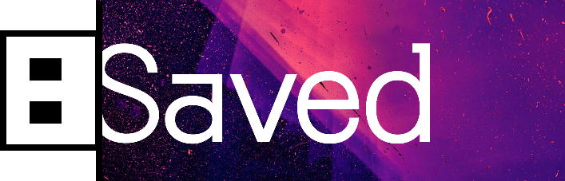
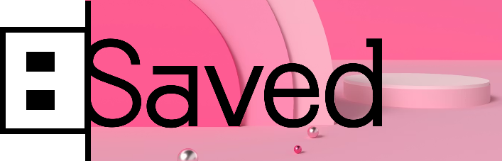
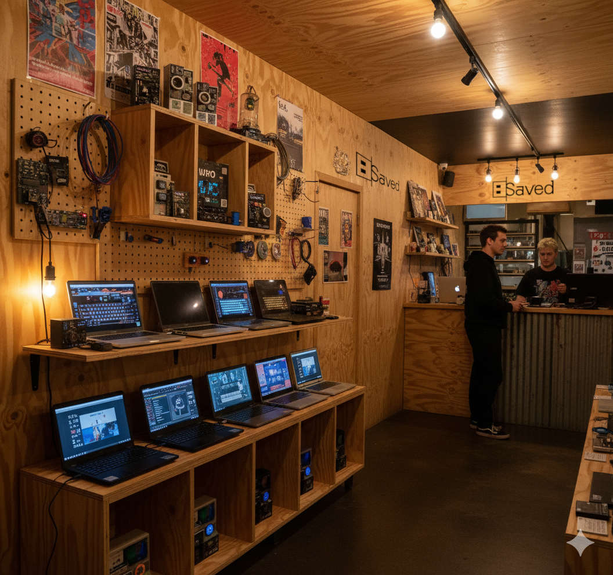
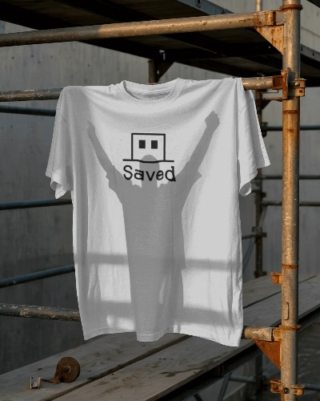

## Go-to-market

### Name and brand

The name and go-to-market brand for the venture is Saved. 

Indicative vessel logo:

  
  

The brand represents:

- The urgent need to save these Windows 10 laptops with a nod to a daily IT action (“have you saved it?”)
- The longer-term need to save us from bigtech lock-in, the high cost of technology, addictive design, and post-automation precarity.

### Market focus

The venture is local-first, only looking to save these Windows 10 laptops before they leave our region. 

Once operationally established, the wider opportunity will be considered; albeit conscious of the urgency of the problem nationwide, and globally. 

### Visibility

Initially the venture is focused on channels and partners and not direct-to-consumer transactions. Even so, the venture will be present in the community and not just positioned as a back-office service.

### Brand voice

Over time, as the venture moves closer to the customer, brand messaging and treatments will position the brand, products, and services to speak to:

- Young (15-30, and the young-at-heart) indie creators, artists, developers, environmentalists—the new cyberpunks
- Those with an urge to live better: conscious of their footprint, the cost of living, bigtech lock-in, and addictive design philosophies. 

#### Example logo treatments

The logo is designed to be used as a vessel for speaking to different audiences.

  <figure>
    
  </figure>
  <figure>
    
  </figure>
  <figure>
    
  </figure>
  <figure>
    
  </figure>

*Treatments of the Saved logo as a vessel for different voices.*

#### Brand examples in context

Even though a store-front and learning space is anticipated later in the roadmap, the intention is to be present in the community. 

  <figure>
    
    <figcaption>Saved out-and-about representing values.  Source: TERN Bicycles</figcaption>
  </figure>
  <figure>
    
    <figcaption>Imagining a creative store-front. Source: Nano Banana. 
<em>Initial prompt: A local retail store front in a sort of bohemian area, ideally it looks like a shop in New Zealand; the store sells revived laptops and other products that appeal to indie kids.</em></figcaption>
  </figure>
  <figure>
    
    <figcaption>Imagining in-store ambience. Source: Nano Banana. 
<em>Initial prompt: an image in-store, I want it to have a plywood feel for the display of the laptops etc, a bit like a local izakaya/bar in Japan - a bit of a lived-in feel, definitely not too rustic, and still a cool vibe.</em></figcaption>
  </figure>
  <figure>
    
    <figcaption>Imagining workshop space for certifications and qualifications. Source: Nano Banana. 
<em>Initial prompt: Imagine there is an additional larger room out the back where workshops and qualifications are run with young adults - similar plywood style long desks with the laptops on them - some nice big windows.</em></figcaption>
  </figure>
  <figure>
    
    <figcaption>Example sports team sponsorship. 
Source: Gisborne Thistle AFC</figcaption>
  </figure>
  <figure>
    
    <figcaption>Example community initiative sponsorship. 
Source: Gisborne District Council</figcaption>
  </figure>
  <figure>
    
    <figcaption>Example promotional merchandise. Source: Mockey.</figcaption>
  </figure>
  <figure>
    
    <figcaption>Example promotional merchandise. Source: Mockey.</figcaption>
  </figure>

